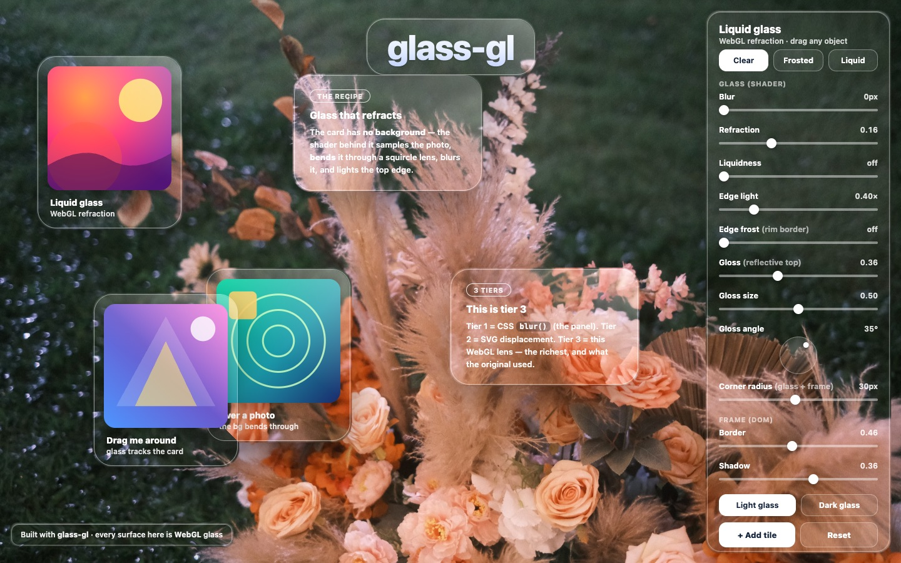

# glass-gl

Real **WebGL liquid glass** for the web — a tiny, framework-agnostic engine that makes
any DOM element refract the background behind it like a physical glass lens (bend +
magnify + frost + edge light), not just a `backdrop-filter` blur.



> **⚠️ Experimental.** Early and evolving — the API, parameters, and visuals may change
> without notice, and it isn't production-hardened yet. The engine works; packaging and a
> React wrapper are in progress.

## What it does

You give it a **background to refract** (image, canvas, video, gradient) and register the
elements you want to be glass. The engine runs one fullscreen WebGL canvas behind your
page and draws a refracting lens at each registered element's position every frame — so
the glass tracks elements as they move, drag, or resize.

```js
import { createGlass } from "glass-gl";

const glass = createGlass({ canvas, background: "/bg.jpg" });

glass.register(el);          // any element becomes liquid glass
glass.setParams({
  refraction: 0.22,          // lens strength
  blur: 1.2,                 // frost
  liquidness: 0.0,           // milky-white mix
  edgeLight: 1.0,            // top sheen
  edgeFrost: 0.22,           // rim border
  radius: 30,                // match the element's border-radius
  tint: [1, 1, 1],           // glass colour
});

glass.unregister(el);
glass.setBackground("/other.jpg");
glass.destroy();
```

## The one rule

Liquid glass needs **something to bend**. The effect refracts a *background layer you give
it* — a photo, video, gradient, or canvas. It does **not** refract arbitrary live DOM
sitting behind it (that would require rasterising the page every frame). For "frosted glass
over scrolling content," the browser's own `backdrop-filter` is the right tool; `glass-gl`
is for glass over a media/background surface — hero sections, backdrops, draggable tiles.

## Demo

`playground/index.html` is an interactive playground (drag glass cards over a photo, tune
every parameter live). It is itself a consumer of `glass-gl.js` — the same engine you'd
install.

```bash
cd playground && python3 -m http.server 8000
# open http://localhost:8000
```

## Releasing

`glass-gl` ships from `packages/glass-gl`, and the release process is kept simple while the
project is experimental:

1. Bump the `version` in `packages/glass-gl/package.json` and commit (Conventional Commits —
   `feat:` / `fix:` / `chore:` …).
2. Run the **Publish glass-gl** workflow — GitHub → Actions → *Run workflow*, or
   `gh workflow run "Publish glass-gl"`.
3. CI publishes to npm and cuts a matching GitHub Release — only when that version isn't already
   on npm. It does **not** run on push, so a routine commit can't surprise-publish.

> The engine lives once: `packages/glass-gl/glass-gl.js` is canonical and `playground/glass-gl.js`
> is a symlink to it — edit the package file.

Full semantic-release automation and the `production` deploy gate are intentionally deferred;
see `AGENTS.md` and `.claude/skills/` for that setup when it's needed.

## License

MIT © wiiiimm
